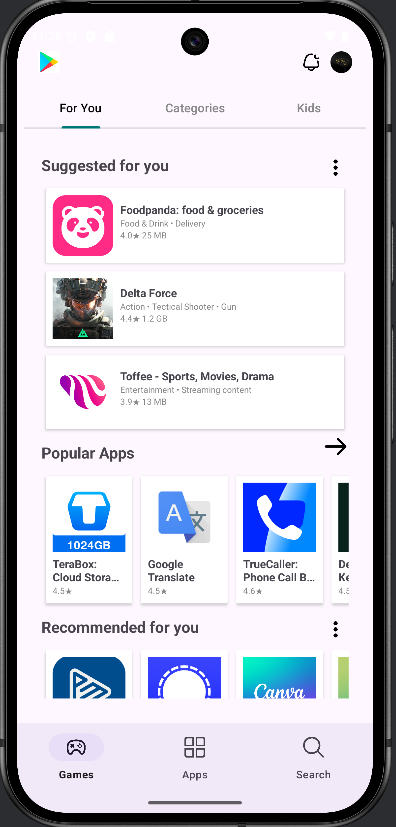
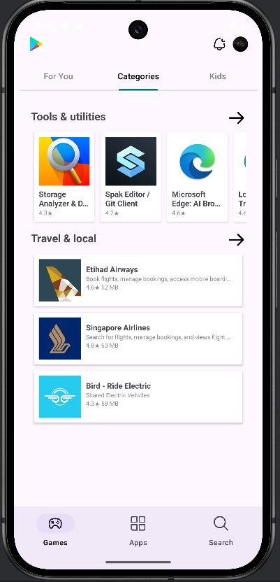
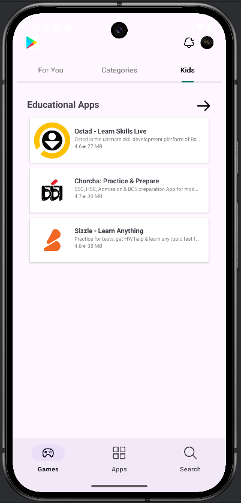
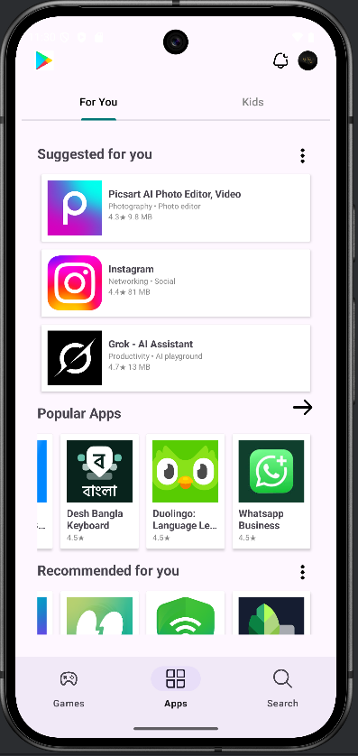
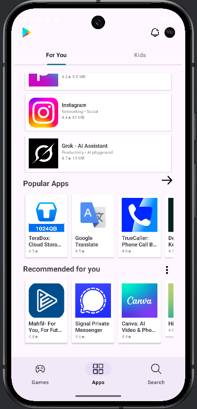
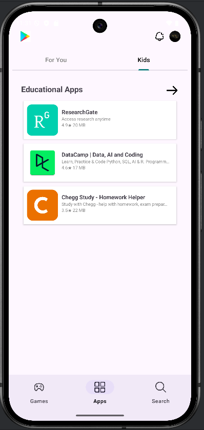
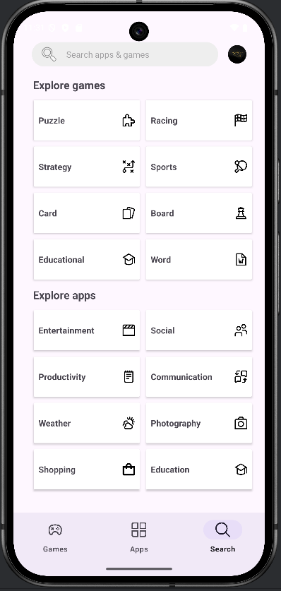

# 📱 Play Store – Play Store-style Android UI

A sleek and responsive Play Store-inspired Android application UI, designed using modern Android components like RecyclerView, ConstraintLayout, and GridLayoutManager.

## ✨ Features

- 🔍 Search Bar with icon
- 🧩 Games & App Categories displayed using Grid-based RecyclerView
- 🎮 Horizontal & Vertical Lists for dynamic section layouts
- 💡 Clean Material Design interface
- 📦 Uses drawable icons instead of URLs for smooth offline support

## 🚀 Technologies Used

- Java
- Android Studio
- RecyclerView
- ConstraintLayout
- GridLayoutManager
- CardView
- GridLayoutManager

## 📸 Screenshots

|  Games Screen-01  |  Games Screen-02  |   Games Screen-03  |
|-------------------|-------------------|--------------------|
|  |  |   |

|  Apps Screen-01   |  Apps Screen-02   |   Apps Screen-03   |
|-------------------|-------------------|--------------------|
|  |  |   |

| Search Screen |
|----------------|
|  |


## 🚀 Getting Started

### Requirements

- Android Studio Hedgehog or newer
- Gradle 8.8 or compatible version
- Android SDK 24+

### Installation

1. Clone the repository:
   ```bash
   git clone https://github.com/Saadmahmud-CSE/Play_Store.git
2. Open the project in Android Studio.
3. Build and run on emulator or physical device.
